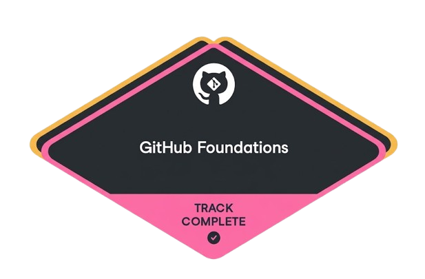
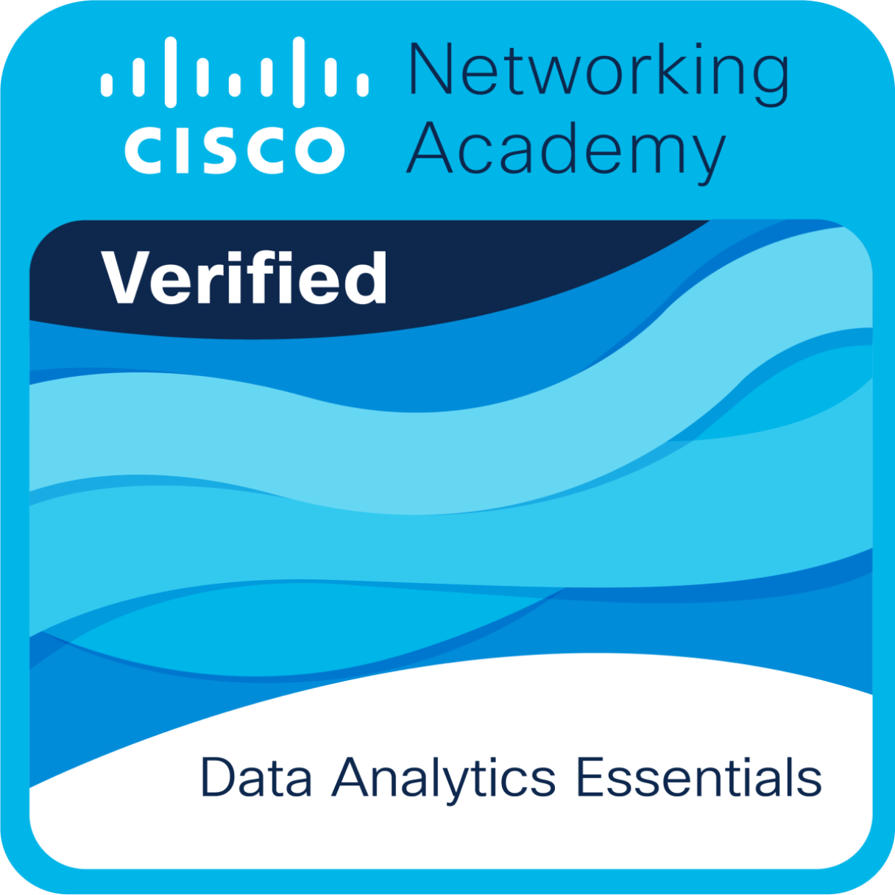
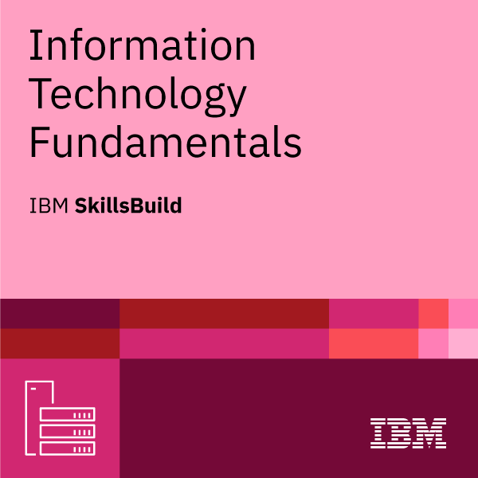
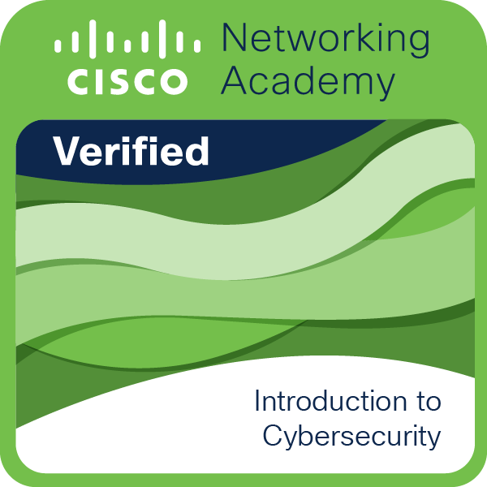

# Hi, I'm Izy. 👋

  

---

## Czercie Lhyanne Basco

### Iskolar ng Bayan
**Bachelor of Science in Information Technology**  
Polytechnic University of the Philippines (PUP) Sta.Mesa Manila

---
## 🛠️ Tech Stack

<table>
  <tr>
    <td valign="top"><b>Languages & Web</b></td>
    <td>
      
      
      
      
      
      
      
      
    </td>
  </tr>
  <tr>
    <td valign="top"><b>Frameworks</b></td>
    <td>
      
    </td>
  </tr>
  <tr>
    <td valign="top"><b>Database</b></td>
    <td>
      
    </td>
  </tr>
  <tr>
    <td valign="top"><b>AI & Machine Learning</b></td>
    <td>
      
      
      
      
    </td>
  </tr>
  <tr>
    <td valign="top"><b>Design</b></td>
    <td>
      
      
    </td>
  </tr>
  <tr>
    <td valign="top"><b>Git & Cloud</b></td>
    <td>
      
      
      
    </td>
  </tr>
</table>

---

## 📜 Certifications

  
  
  
  
  

---

## 🤝 Affiliations

- **Data Engineering Philippines** — Scholar
- **Google Developer Group PUP** — Member
- **Institute of Bachelors in Information Technology Studies (IBITS PUP)** — Member

---

## 🔗 Connect with Me

  
  
  
  

---

  <i>Learning, building, and growing one project at a time. ✨</i>

